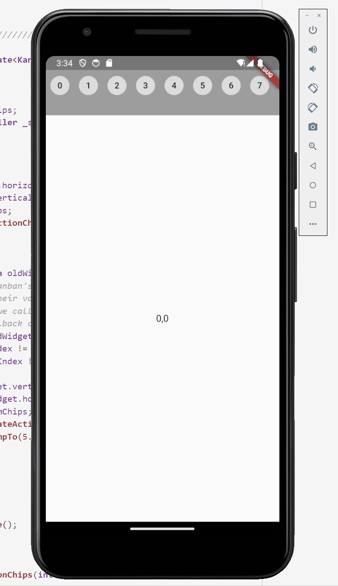

# infinite scroll kanban widget

### This widget has a kanban uptop that has infinite scroll (it will cycle through the provided elements in both directions). Each element is pressable and will update the body of the app with that element. Accordingly, updates to the body of the app update the kanban position too. You can use either to find the element you want. This intended to provide 2 different ways (fast and slow) to scroll through content, such as in a social media app.

The demo displays the infinite scroll, followed by the kanban press update (to kanban and body), followed by the swiping in the body that performs the same update, albeit on element at a time.
  

